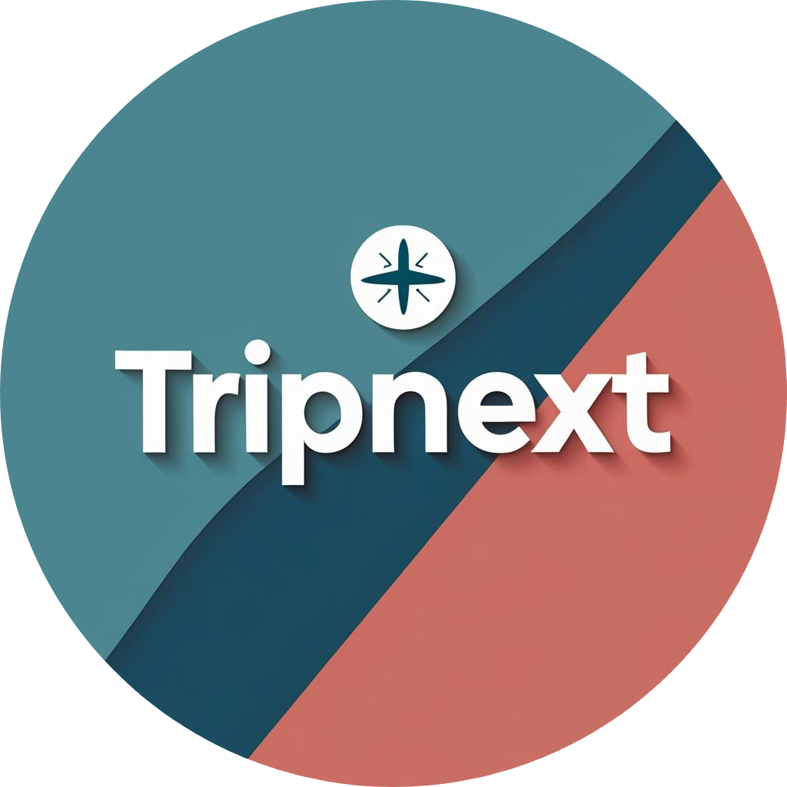
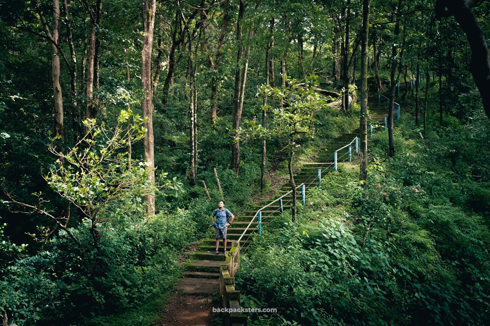

# ✈️ TripNext - Modern Travel Planning & Sharing Platform

<div align="center">
  
  <br />
  <h3>Where Your Next Adventure Begins</h3>
  
  
  
  
  
  
  
  
</div>

<p align="center">
  
</p>

## 🌟 Overview

TripNext is a comprehensive travel planning and sharing platform that connects travelers with local guides, allows trip recommendations based on preferences, enables blog sharing, and features an interactive travel gallery. With real-time chat, personalized profiles, and secure authentication, TripNext offers a complete ecosystem for travel enthusiasts.

## ✨ Key Features

### For Travelers

- 🧳 **Personalized Trip Planning** - Get AI-powered trip recommendations based on your preferences
- 📸 **Interactive Gallery** - Share and explore travel photos in an immersive gallery experience
- 📝 **Travel Blogs** - Create, read, and comment on travel blogs from the community
- 📦 **Trip Packages** - Browse and book curated trip packages from verified guides

### For Guides

- 💼 **Package Management** - Create and manage travel packages to showcase to travelers
- 📊 **Dashboard Analytics** - Track your packages, bookings, and engagement metrics
- 💬 **Direct Communication** - Chat with interested travelers about your packages

### General Features

- 🔒 **Secure Authentication** - Email verification and secure password management
- 💬 **Real-time Chat** - Instant messaging between travelers and guides
- 🌙 **Dark/Light Mode** - Choose your preferred theme for comfortable browsing
- 📱 **Responsive Design** - Seamless experience across all devices

## 🛠️ Tech Stack

### Frontend

- **Next.js 14** - React framework with App Router for optimized client and server components
- **TypeScript** - Type-safe code for better developer experience
- **TailwindCSS** - Utility-first CSS framework for responsive design
- **Shadcn/UI** - High-quality reusable components built on Radix UI
- **Framer Motion** - Animations and interactive elements
- **NextAuth.js** - Authentication solution with JWT sessions
- **Socket.IO Client** - Real-time bidirectional event-based communication
- **Three.js & React Three Fiber** - 3D globe visualization

### Backend

- **Node.js & Express** - Fast, unopinionated web framework
- **MongoDB & Mongoose** - NoSQL database for flexible data modeling
- **Socket.IO** - Real-time communication server
- **JWT** - Secure authentication tokens
- **Cloudinary** - Cloud storage for images
- **Nodemailer** - Email sending for verification and notifications
- **bcrypt.js** - Password hashing and security

## 📋 Project Structure

```
TripNext/
├── frontend/               # Next.js frontend application
│   ├── public/             # Static assets
│   └── src/
│       ├── app/            # Next.js App Router
│       │   ├── (Home)      # Home page components
│       │   ├── auth/       # Authentication pages
│       │   ├── blogs/      # Blog pages and components
│       │   ├── guide/      # Guide dashboard and components
│       │   └── user/       # User dashboard and components
│       ├── components/     # Shared UI components
│       ├── hooks/          # Custom React hooks
│       └── lib/            # Utility functions and services
│
└── backend/                # Express backend API
    ├── src/
    │   ├── controllers/    # Route controllers
    │   ├── db/             # Database configuration
    │   ├── middleware/     # Express middleware
    │   ├── models/         # Mongoose models
    │   ├── routes/         # API routes
    │   └── utils/          # Helper functions
    └── index.js            # Server entry point
```

## 🚀 Getting Started

### Prerequisites

- Node.js (v18 or higher)
- MongoDB
- Cloudinary account (for image storage)

### Installation

1. Clone the repository

```bash
git clone https://github.com/yourusername/tripnext.git
cd tripnext
```

2. Install backend dependencies

```bash
cd backend
npm install
```

3. Set up environment variables

```bash
# Create a .env file in the backend directory with the following:
PORT=5000
MONGODB_URI=your_mongodb_connection_string
JWT_SECRET=your_jwt_secret
CLIENT_URL=http://localhost:3000
CLOUDINARY_CLOUD_NAME=your_cloudinary_cloud_name
CLOUDINARY_API_KEY=your_cloudinary_api_key
CLOUDINARY_API_SECRET=your_cloudinary_api_secret
EMAIL_SERVICE=your_email_service
EMAIL_USERNAME=your_email_username
EMAIL_PASSWORD=your_email_password
```

4. Install frontend dependencies

```bash
cd ../frontend
npm install
```

5. Set up frontend environment variables

```bash
# Create a .env.local file in the frontend directory with:
NEXT_PUBLIC_API_URL=http://localhost:5000
NEXT_PUBLIC_SOCKET_URL=http://localhost:5000
NEXTAUTH_URL=http://localhost:3000
NEXTAUTH_SECRET=your_nextauth_secret
```

6. Start the development servers

```bash
# In the backend directory
npm run dev

# In the frontend directory (in a separate terminal)
npm run dev
```

7. Open your browser and visit `http://localhost:3000`

## 📸 Screenshots

<div align="center">
  
  
</div>
<div align="center" style="margin-top: 20px;">
  
  
</div>

## ⚙️ Core Functionality

### Authentication Flow

- **Sign Up**: Email & password registration with email verification
- **Login**: Secure login with role-based redirection (user/guide)
- **Password Reset**: Secure password recovery via email

### User Journey

1. **Sign up/Login** to access personalized features
2. **Browse Trip Recommendations** tailored to preferences
3. **Explore Trip Packages** offered by verified guides
4. **Chat with Guides** to learn more about packages
5. **Share Travel Experiences** through blogs and gallery posts
6. **Engage with Community** by commenting on blogs

### Guide Journey

1. **Create Guide Profile** with expertise and credentials
2. **Create Trip Packages** with details, pricing, and images
3. **Manage Bookings** and communication with interested travelers
4. **Share Travel Insights** through the blog platform

## 🔒 Security Features

- Secure email verification process
- JWT-based authentication with short expiry
- Password hashing with bcrypt
- Role-based access control for routes and components
- Protected API endpoints with authentication middleware
- Secure session management with NextAuth.js

## 🤝 Contributing

Contributions are welcome! Please feel free to submit a Pull Request.

1. Fork the repository
2. Create your feature branch (`git checkout -b feature/amazing-feature`)
3. Commit your changes (`git commit -m 'Add some amazing feature'`)
4. Push to the branch (`git push origin feature/amazing-feature`)
5. Open a Pull Request

## 📄 License

This project is licensed under the MIT License - see the LICENSE file for details.

## 📧 Contact

For any inquiries or support, please contact us at tripnext@example.com.

---

<div align="center">
  <p>Built with ❤️ by the TripNext Team</p>
  <p>
    <a href="https://twitter.com/tripnext">Twitter</a> •
    <a href="https://instagram.com/tripnext">Instagram</a> •
    <a href="https://linkedin.com/company/tripnext">LinkedIn</a>
  </p>
</div>
